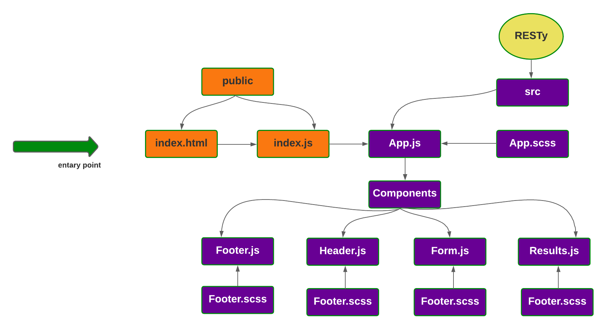

# RESTy App :

## Author : Dunia Alkilany 

## Description :

### 4-Phase build of the RESTy application, written in React. In this first phase, our goal is to setup the basic scaffolding of the application, with intent being to add more functionality to the system as we go. This initial build sets up the file structure so that we can progressively build this application in a scalable manner.

## RESTy Phase 1:

### Begin work on the RESTy API testing application

## RESTy Phase 2:

### In phase 2, we will be receiving user input in preparation of connecting to live APIs, using the useState() hook in our functional components

## RESTy Phase 3:

### In phase 3, we will be connecting RESTy to live APIs, fetching and displaying remote data. Our primary focus will be to service GET requests


## Links and Resources:


* ### [Github Actions](https://github.com/Duniaalkilany/resty/actions)

* ### [code sand box /Phase 1](https://codesandbox.io/s/friendly-silence-cp725)

* ### [code sand box /Phase 2](https://6ry9i.csb.app/)

* ### [code sand box /Phase 3](https://6ry9i.csb.app/)

* ### [lab 26 pull request ](https://github.com/Duniaalkilany/resty/pull/1)

* ### [lab 27 pull request ](https://github.com/Duniaalkilany/resty/pull/2)

* ### [lab 28 pull request ](https://github.com/Duniaalkilany/resty/pull/6)

## UML : 



## expicted result /lab 26 :
* ### any link:
   
    - ### get

 

  ```

  {
  "count": 2,
  "results": [
    {
      "name": "fake thing 1",
      "url": "http://fakethings.com/1"
    },
    {
      "name": "fake thing 2",
      "url": "http://fakethings.com/2"
    }
  ]
  }

  ```


## expicted result /lab 27-28 :

* ### randomURL

    - ### get or post or putor delete​

### Request Method: get or post or put or delete URL: randomURL

```
  loading sppiner

```  
​
* ### valid api URL example : https://pokeapi.co/api/v2/pokemon

    - ### get or post or put or delete​

### Request Method: get or post or put or delete URL: https://pokeapi.co/api/v2/pokemon

```
  {
  "count": 1118,
  "next": "https://pokeapi.co/api/v2/pokemon?offset=20&limit=20",
  "previous": null,
  "results": [
    {
      "name": "bulbasaur",
      "url": "https://pokeapi.co/api/v2/pokemon/1/"
    },
    {
      "name": "ivysaur",
      "url": "https://pokeapi.co/api/v2/pokemon/2/"
    },
    {
      "name": "venusaur",
      "url": "https://pokeapi.co/api/v2/pokemon/3/"
    },
    {
      "name": "charmander",
      "url": "https://pokeapi.co/api/v2/pokemon/4/"
    },
    {
      "name": "charmeleon",
      "url": "https://pokeapi.co/api/v2/pokemon/5/"
    },
    {
      "name": "charizard",
      "url": "https://pokeapi.co/api/v2/pokemon/6/"
    },
    {
      "name": "squirtle",
      "url": "https://pokeapi.co/api/v2/pokemon/7/"
    },
    {
      "name": "wartortle",
      "url": "https://pokeapi.co/api/v2/pokemon/8/"
    },
    {
      "name": "blastoise",
      "url": "https://pokeapi.co/api/v2/pokemon/9/"
    },
    {
      "name": "caterpie",
      "url": "https://pokeapi.co/api/v2/pokemon/10/"
    },
    {
      "name": "metapod",
      "url": "https://pokeapi.co/api/v2/pokemon/11/"
    },
    {
      "name": "butterfree",
      "url": "https://pokeapi.co/api/v2/pokemon/12/"
    },
    {
      "name": "weedle",
      "url": "https://pokeapi.co/api/v2/pokemon/13/"
    },
    {
      "name": "kakuna",
      "url": "https://pokeapi.co/api/v2/pokemon/14/"
    },
    {
      "name": "beedrill",
      "url": "https://pokeapi.co/api/v2/pokemon/15/"
    },
    {
      "name": "pidgey",
      "url": "https://pokeapi.co/api/v2/pokemon/16/"
    },
    {
      "name": "pidgeotto",
      "url": "https://pokeapi.co/api/v2/pokemon/17/"
    },
    {
      "name": "pidgeot",
      "url": "https://pokeapi.co/api/v2/pokemon/18/"
    },
    {
      "name": "rattata",
      "url": "https://pokeapi.co/api/v2/pokemon/19/"
    },
    {
      "name": "raticate",
      "url": "https://pokeapi.co/api/v2/pokemon/20/"
    }
  ]
}
© Dunia Alkilany-2021

```

## Test Report /lab 27:


## Test Report /lab 28:


